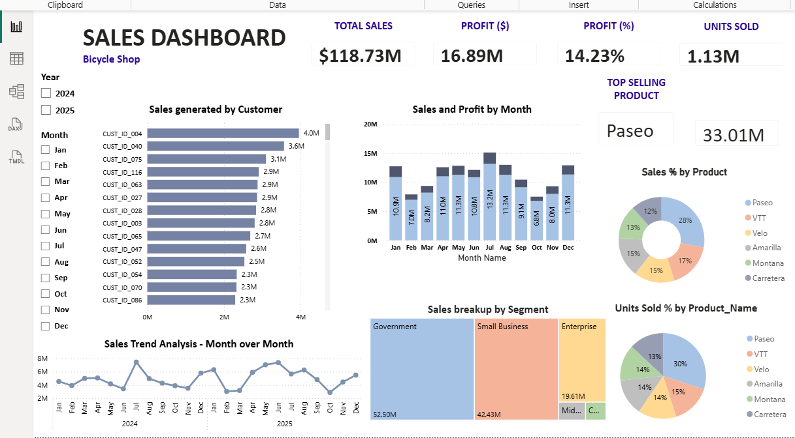

# Sales Performance Dashboard

## Overview

This project is an interactive Power BI dashboard developed to analyze sales performance and key business metrics. The dashboard provides actionable insights into sales trends, profitability, customer behavior, and product performance through dynamic visualizations and interactive filtering.

## Dashboard Preview

## Key Highlights

- Developed an interactive sales performance dashboard in Microsoft Power BI.
- Built dynamic visualizations to monitor key business metrics.
- Applied Power Query for data preparation and transformation.
- Designed an intuitive and user-friendly dashboard for business reporting.

## Features

- Sales Performance Analysis
- Profit Analysis
- Product Performance
- Customer Insights
- KPI Cards
- Interactive Slicers
- Trend Analysis
- Dynamic Visualizations

## Tools Used

- Microsoft Power BI
- Power Query
- Data Modeling
- Data Visualization

## Skills Demonstrated

- Power BI Dashboard Development
- Business Intelligence
- Data Modeling
- Power Query
- Sales Analytics
- KPI Reporting
- Data Visualization

## Files Included

- `Sales Report Dashboard.pbix` – Power BI dashboard
- `Dashboard.png` – Dashboard preview
- `README.md` – Project documentation

## Author

**Preethi Rajendran**

Aspiring Financial Analyst |  US CMA (Parts 1 & 2 cleared)
